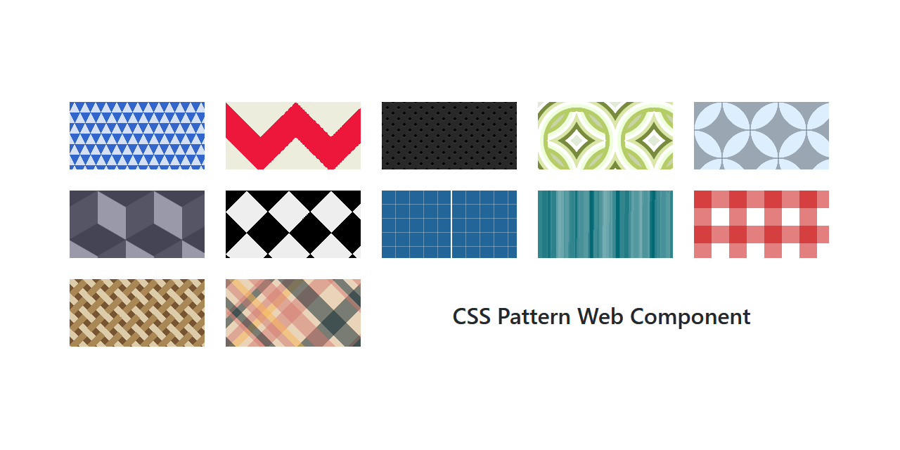

# CSS Pattern Web Component

This web component creates a background pattern only by using CSS. It is very usefull to quickly create nice looking placeholders for profile pictures. It is a fork of a [CSS3 pattern collection](https://leaverou.github.io/css3patterns/). 

## Demo

[](https://jwillmer.github.io/pattern-web-component/)

The docs folder contains the compiled source code of this component. You can visit the [demo page](https://jwillmer.github.io/pattern-web-component/) for more examples.

## Usage

For a comprehensive demo on how to use this component you can investigate the [/src/index.html](/src/index.html).

```html
<!-- Define which pattern to display -->
<css-pattern pattern="half-rombes">
    <!-- Your content -->
</css-pattern>

<!-- Get a consistent pattern from a string value. Usefull for profile image placeholders. -->
<css-pattern pattern-for="John Doe">
    <!-- Your content -->
</css-pattern>

<!-- Change CSS properties of the component  -->
css-pattern {
    --border-radius: 15px;
    --width: 15vw;
    --height: 15vh;
}
```

## Development

run:

```bash
npm install
npm start
```

To build the component for production, run:

```bash
npm run build
```

To run the unit tests for the components, run:

```bash
npm test
```

Need help? Check out our docs [here](https://stenciljs.com/docs/my-first-component).


## Using this component

### Node Modules
- Run `npm install @jwillmer/pattern-component --save`
- Put a script tag similar to this `<script src='node_modules/@jwillmer/pattern-component/dist/css3pattern.js'></script>` in the head of your index.html
- Then you can use the element anywhere in your template, JSX, html etc

### In a stencil-starter app
- Run `npm install @jwillmer/pattern-component --save`
- Add an import to the npm packages `import @jwillmer/pattern-component;`
- Then you can use the element anywhere in your template, JSX, html etc
